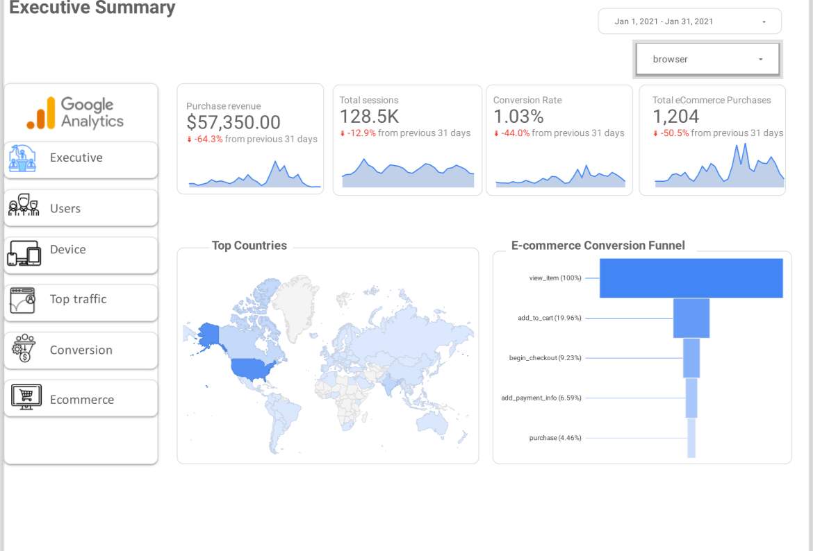

# Web Analytics Dashboard Accelerator

## Overview
This project provides a reusable analytics foundation for GA4 data using BigQuery and Looker Studio.
It focuses on transforming raw GA4 event data into session-level, BI-ready datasets that can be used
to quickly build reliable web analytics dashboards.

## Problem
GA4 exports data to BigQuery in a raw, event-based format with nested fields.
This makes common analytics tasks difficult:
- Session-level analysis is not readily available
- Metrics like bounce rate must be custom-defined
- Queries become complex due to nested structures
- BI tools struggle with raw GA4 schemas

## Solution
This accelerator introduces a structured transformation layer in BigQuery:
- Raw GA4 events are flattened into analysis-friendly tables
- Sessions are derived from event data
- Engagement and conversion metrics are calculated
- Optimized tables are consumed directly by Looker Studio

## Execution Flow
GA4 BigQuery export  
→ Data flattened and sessionized in BigQuery  
→ Engagement and conversion metrics derived  
→ Looker Studio dashboards built on transformed tables  

## Dashboard Preview
The dashboard below was built using the transformed GA4 data and validates
the usability of the underlying data model.

### Executive Summary

## Technology Stack
- Google Analytics 4
- BigQuery
- SQL
- Looker Studio

## Scope Notes
This project focuses on the data modeling and transformation layer.
Dashboard visuals are included only to demonstrate data usability,
not to replicate the GA4 interface.
